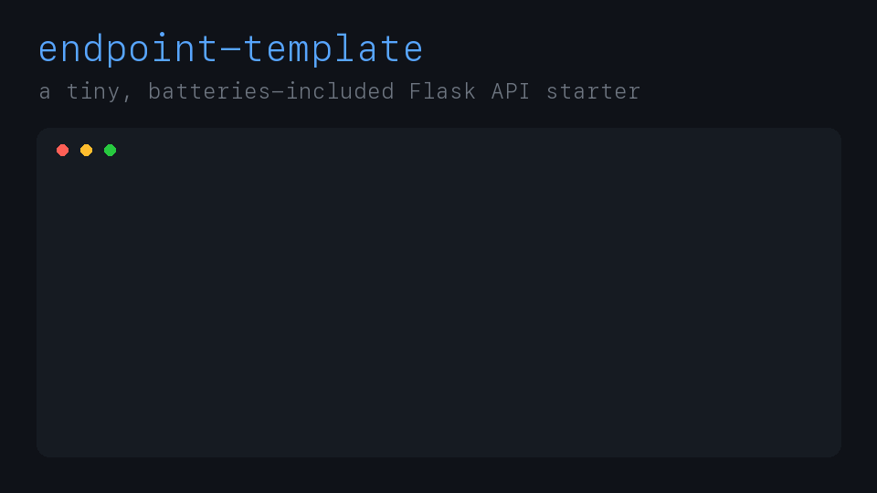
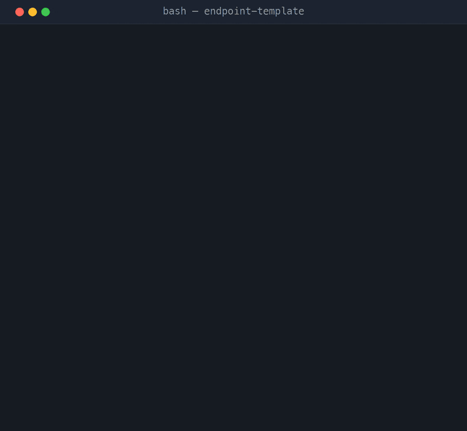
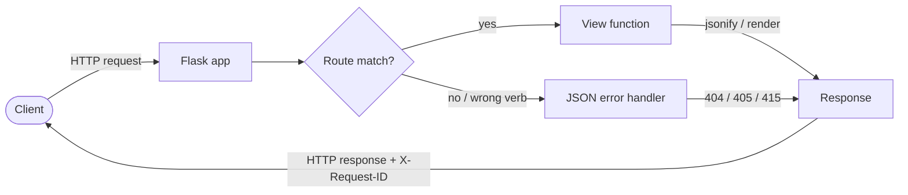

# endpoint-template

> A tiny, batteries-included Flask starter. Stop staring at a blank `app.py` — fork this, drop your routes in, and go.

<p align="center">
  
  
  
  
  
</p>

Every API project starts the same way: a blank file, a half-remembered `from flask import Flask`, and twenty minutes of googling how to return JSON without it looking sad. **endpoint-template** skips all of that. It's a minimal-but-real Flask app with a friendly landing page, a health check, a couple of example JSON endpoints, and tests that already pass. Clone it and you're building features in the first minute, not the fortieth.

<p align="center">
  
</p>

<p align="center">
  
</p>

---

## What's in the box

- **A real landing page** at `/` that lists every route you expose — no more grepping your own code to remember the URL.
- **`GET /api/health`** — liveness plus uptime and Python version, ready to point a load balancer or uptime monitor at.
- **`GET /api/time`** — current server time in ISO and epoch. A clean example of shaping a JSON response.
- **`GET /api/uuid`** — generate a UUID4, or a batch with `?count=1..100`. A ready-made id-generator with input validation to copy from.
- **`POST /api/echo`** — reads a JSON body, validates it, echoes it back. Your copy-paste reference for handling input.
- **`X-Request-ID` on every response** — the app assigns a correlation id to each request (honouring one the caller sends), so you can trace a request across your logs from day one.
- **`GET /testing_api`** — the original `Hello, World!` route, kept around for old times' sake.
- **JSON error handlers** so 404s and 405s come back as JSON, not HTML.
- **An app factory** (`create_app`) so tests spin up isolated instances with zero global-state headaches.
- **A passing test suite** so you know green means green.

## Requirements

You'll need just two things:

- **Python 3.10 or newer** — check with `python3 --version`
- **pip** — it ships with Python

That's it. No database, no build step, no Node.

## Quick start

Copy-paste, top to bottom:

```bash
# 1. Grab the code
git clone https://github.com/waleedsworld/endpoint-template.git
cd endpoint-template

# 2. Create and activate a virtual environment
python3 -m venv .venv
source .venv/bin/activate          # Windows: .venv\Scripts\activate

# 3. Install the one dependency
pip install -r requirements.txt

# 4. Run it
python app.py
```

Now open **http://127.0.0.1:5000** and you'll see the landing page above. 🎉

Prefer the Flask CLI? `flask --app app run --debug` works too.

## Take it for a spin

Everything speaks JSON:

```bash
curl http://127.0.0.1:5000/api/health

curl http://127.0.0.1:5000/api/uuid?count=3

curl -X POST http://127.0.0.1:5000/api/echo \
  -H "Content-Type: application/json" \
  -d '{"hello": "world"}'
```

Here's what that looks like against the running server:

<p align="center">
  
</p>

## API reference

| Method | Path            | Description                        | Success |
| ------ | --------------- | ---------------------------------- | ------- |
| `GET`  | `/`             | Landing page listing every route   | `200`   |
| `GET`  | `/api/health`   | Liveness, uptime, Python version   | `200`   |
| `GET`  | `/api/time`     | Server time as ISO + epoch (UTC)   | `200`   |
| `GET`  | `/api/uuid`     | Generate UUID4(s), `?count=1..100` | `200`   |
| `POST` | `/api/echo`     | Validate and echo a JSON body      | `200`   |
| `GET`  | `/testing_api`  | The original `Hello, World!` route | `200`   |

Every response carries an `X-Request-ID` header — the app honours one you send or mints a fresh UUID4 so you can correlate a request across your logs.

Send `/api/echo` a non-JSON request and you'll get a `415`; send it malformed JSON and you'll get a `400` — both as clean JSON error objects. `/api/uuid` rejects a `count` outside `1..100`, or a non-numeric one, with a `400`.

## Architecture

One file, no magic. `create_app()` is an [application factory](https://flask.palletsprojects.com/en/latest/patterns/appfactories/): it builds a fresh, fully-configured `Flask` instance, wires up the routes and error handlers, and hands it back. A module-level `app = create_app()` exists so `flask run` and WSGI servers pick it up, while your tests call the factory directly for isolated instances.



- **`create_app(config)`** — the factory. Pass a `dict` to override config in tests.
- **`register_request_id(app)`** — assigns and echoes the `X-Request-ID` correlation header.
- **`register_routes(app)`** — all view functions live here. Add yours alongside them.
- **`register_error_handlers(app)`** — turns framework errors into JSON so clients never get a surprise HTML page.

Because there's no global state beyond a boot timestamp, every test gets a pristine app and nothing leaks between them.

## Adding your own endpoint

Open `app.py`, find `register_routes`, and add a function:

```python
@app.route("/api/greet/<name>")
def greet(name):
    return jsonify(message=f"Hey there, {name}!")
```

Save, and Flask's reloader picks it up instantly. Then add a matching test in `tests/test_app.py` and you're done.

## Running the tests

```bash
pip install -r requirements-dev.txt
pytest
```

The suite covers the landing page, every endpoint, UUID generation and its input
validation, the request-id header, JSON validation and error shapes, the
404/405 handlers, and the application factory's configuration wiring. Fixtures
live in `tests/conftest.py` so each test gets a fresh, isolated app instance.

## Deploying

The app exposes a module-level `app`, so any WSGI server just works:

```bash
pip install gunicorn
gunicorn app:app
```

Set `PORT` to change the port and `FLASK_DEBUG=0` to turn off the reloader in production.

## Configuration

Two environment variables, both optional:

| Variable      | Default | What it does                                   |
| ------------- | ------- | ---------------------------------------------- |
| `PORT`        | `5000`  | Port the dev server binds to                   |
| `FLASK_DEBUG` | `1`     | `1` enables the auto-reloader; set `0` in prod |

## Live demo

Live demo — deploying soon.

## Project layout

```
endpoint-template/
├── app.py                 # the whole app: factory, routes, error handlers
├── requirements.txt       # just Flask
├── requirements-dev.txt   # + pytest for the test suite
├── pytest.ini             # pytest configuration
├── templates/
│   └── index.html         # the landing page
├── static/
│   └── style.css          # its styling
├── tests/
│   ├── conftest.py        # shared app / client fixtures
│   ├── test_app.py        # landing page + endpoint smoke tests
│   ├── test_api.py        # JSON API behaviour
│   ├── test_errors.py     # 404 / 405 handlers
│   └── test_factory.py    # create_app config wiring
├── assets/                # demo GIFs + poster of the app in action
└── docs/media/            # landing-page screenshots
```

## License

MIT — see [LICENSE](LICENSE). Fork it, ship it, make it yours.
