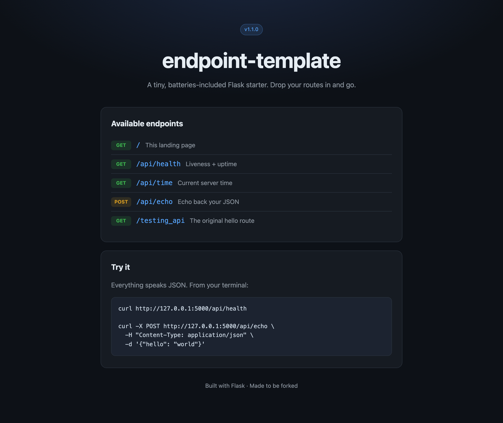

# endpoint-template

> A tiny, batteries-included Flask starter. Stop staring at a blank `app.py` — fork this, drop your routes in, and go.

Every API project starts the same way: a blank file, a half-remembered `from flask import Flask`, and twenty minutes of googling how to return JSON without it looking sad. **endpoint-template** skips all of that. It's a minimal-but-real Flask app with a friendly landing page, a health check, a couple of example JSON endpoints, and tests that already pass. Clone it and you're building features in the first minute, not the fortieth.

<p align="center">
  
</p>

---

## What's in the box

- **A real landing page** at `/` that lists every route you expose — no more grepping your own code to remember the URL.
- **`GET /api/health`** — liveness plus uptime and Python version, ready to point a load balancer or uptime monitor at.
- **`GET /api/time`** — current server time in ISO and epoch. A clean example of shaping a JSON response.
- **`GET /api/uuid`** — generate a UUID4, or a batch with `?count=1..100`. A ready-made id-generator with input validation to copy from.
- **`POST /api/echo`** — reads a JSON body, validates it, echoes it back. Your copy-paste reference for handling input.
- **`X-Request-ID` on every response** — the app assigns a correlation id to each request (honouring one the caller sends), so you can trace a request across your logs from day one.
- **`GET /testing_api`** — the original `Hello, World!` route, kept around for old times' sake.
- **JSON error handlers** so 404s and 405s come back as JSON, not HTML.
- **An app factory** (`create_app`) so tests spin up isolated instances with zero global-state headaches.
- **A passing test suite** so you know green means green.

## Requirements

You'll need just two things:

- **Python 3.10 or newer** — check with `python3 --version`
- **pip** — it ships with Python

That's it. No database, no build step, no Node.

## Quick start

Copy-paste, top to bottom:

```bash
# 1. Grab the code
git clone https://github.com/waleedsworld/endpoint-template.git
cd endpoint-template

# 2. Create and activate a virtual environment
python3 -m venv .venv
source .venv/bin/activate          # Windows: .venv\Scripts\activate

# 3. Install the one dependency
pip install -r requirements.txt

# 4. Run it
python app.py
```

Now open **http://127.0.0.1:5000** and you'll see the landing page above. 🎉

Prefer the Flask CLI? `flask --app app run --debug` works too.

## Take it for a spin

Everything speaks JSON:

```bash
curl http://127.0.0.1:5000/api/health

curl http://127.0.0.1:5000/api/uuid?count=3

curl -X POST http://127.0.0.1:5000/api/echo \
  -H "Content-Type: application/json" \
  -d '{"hello": "world"}'
```

## Adding your own endpoint

Open `app.py`, find `register_routes`, and add a function:

```python
@app.route("/api/greet/<name>")
def greet(name):
    return jsonify(message=f"Hey there, {name}!")
```

Save, and Flask's reloader picks it up instantly. Then add a matching test in `tests/test_app.py` and you're done.

## Running the tests

```bash
pip install pytest
pytest
```

The suite covers the landing page, every endpoint, UUID generation and its input validation, the request-id header, JSON validation, and the error handlers.

## Deploying

The app exposes a module-level `app`, so any WSGI server just works:

```bash
pip install gunicorn
gunicorn app:app
```

Set `PORT` to change the port and `FLASK_DEBUG=0` to turn off the reloader in production.

## Live demo

Live demo — deploying soon.

## Project layout

```
endpoint-template/
├── app.py                 # the whole app: factory, routes, error handlers
├── requirements.txt       # just Flask
├── templates/
│   └── index.html         # the landing page
├── static/
│   └── style.css          # its styling
├── tests/
│   └── test_app.py        # pytest suite
└── docs/media/            # screenshots
```

## License

MIT — see [LICENSE](LICENSE). Fork it, ship it, make it yours.
